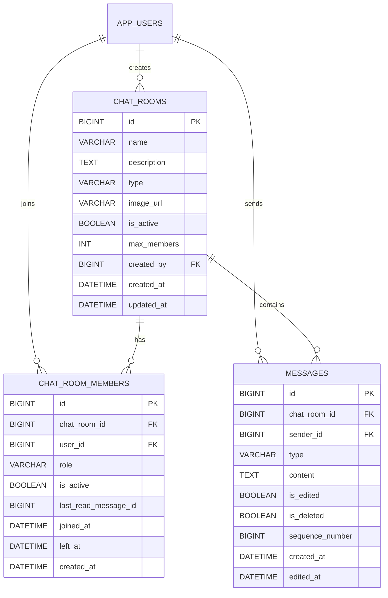

# Lilitalk

Lilitalk is a chat application built around users, chat rooms, chat room members, and messages.

## ERD

## Entity Overview

### app_users

Stores user account information.

- `username` must be unique.
- Stores display name, profile image URL, status message, and active status.
- Tracks the user's last seen time, creation time, and update time.

### chat_rooms

Stores chat room information.

- Stores the room name, description, room type, image URL, and maximum member count.
- References the user who created the chat room through `created_by`.

### chat_room_members

Stores the relationship between users and chat rooms.

- A user can only be registered once in the same chat room.
- Stores member role, active status, last read message ID, joined time, and left time.

### messages

Stores chat messages.

- Each message belongs to a chat room and has a sender.
- Stores message type, content, edit/delete status, and sequence number within the chat room.